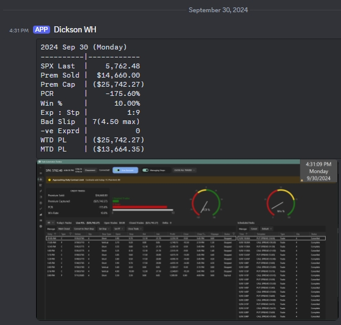

# TradeScout

**TradeScout** is a tool that integrates with trades from [Trade Automation Toolbox (TAT)](https://tradeautomationtoolbox.com/). It provides detailed analytics and metrics to track trade performance based on various parameters and outputs summaries to a configured Discord channel using webhooks.

## Features

TradeScout computes multiple metrics for each trade, including:

- **SPX Last**: The last recorded value of the SPX index for the day.
- **Premium Sold**: Total premium sold from all trades.
- **Premium Captured**: Total premium captured from all trades (profits/losses).
- **PCR (Premium Capture Rate)**: Percentage of premium captured relative to the total premium sold.
- **Win %**: The percentage of profitable trades.
- **Expired Trades**: Number of trades that expired worthless.
- **Stopped Trades**: Number of trades that were closed due to hitting their stop target.
- **Bad Slip**: The number of trades where the slippage (difference between the close price and stop target) is greater than or equal to $0.50. The maximum slippage amount is also displayed.
- **Negative Expired**: Number of trades where that expired but the trade had a negative profit.
- **WTD PL (Week-to-Date Profit/Loss)**: The total premium captured from the most recent Monday to the current day.
- **MTD PL (Month-to-Date Profit/Loss)**: The total premium captured from the first day of the current month to the current day.

## Installation

To install the dependencies required for TradeScout, use the following command:

```bash
pip install -r requirements.txt
```

The `requirements.txt` file includes the following dependencies:

```text
pandas==1.5.3
requests==2.28.1
pygetwindow==0.0.9
pyautogui==0.9.53
threading==0.1.0
sqlite3==0.0.1
PyYAML==6.0
```

Ensure that you have Python installed on your system and `pip` available for installing packages.

### Webhook Setup for Discord

You can configure one or more webhooks for sending notifications to a specific Discord channel or thread.

Here’s an example of how the webhook is structured in the `config.yaml` file:

```yaml
# Path to your database file
# Note: use black slash "/" in path
db_path: "data/data.db3"  

webhooks:
  - url: "https://discord.com/api/webhooks/WEBHOOK_ID"
    thread_id: "THREAD_ID"  # Optional: Sends the message to a specific thread if provided. If omitted, the message will go to the main channel.
  - url: "https://discord.com/api/webhooks/ANOTHER_WEBHOOK"
    thread_id: null  # No thread ID provided; the message will be sent to the main webhook channel.
```

#### Notes:
- **db_path**: This specifies the location of the SQLite database file of TAT (look for a folder called LocalState).
- **webhooks**: You can configure multiple webhooks for different notifications. Each webhook can optionally include a `thread_id` to target a specific thread in a Discord channel.

### Running TradeScout

To run the TradeScout tool, use the following command:

```bash
python trade_scout.py --date YYYYMMDD --win restore
```

Where:
- `--date YYYYMMDD`: Specifies the date for which trades should be processed (e.g., `20240920`). If omitted, the current date will be used.
- `--win`: Adjusts the window size for the application before capturing a screenshot. `restore` restores the window to its original size, while `max` maximizes it.

### Example Output

Here’s an example of the output sent to Discord:

```
2024 Sep 30 (Monday)
---------------------
SPX Last  |  5,762.48
Prem Sold | $14,660.00
Prem Cap  | ($25,742.27)
PCR       | -175.60%
Win %     | 10.00%
Exp : Stp | 1:9
Bad Slip  | 7(4.50 max)
-ve Exprd | 0
WTD PL    | ($25,742.27)
MTD PL    | ($13,664.35)
```



In this output, the SPX index, premium sold, premium captured, and other metrics are displayed, followed by a screenshot of the associated trading data.
